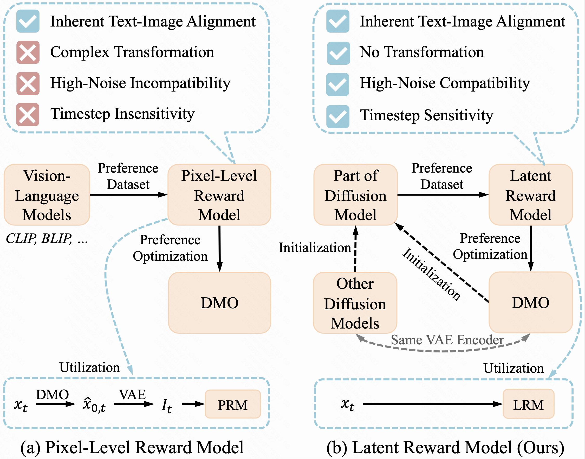
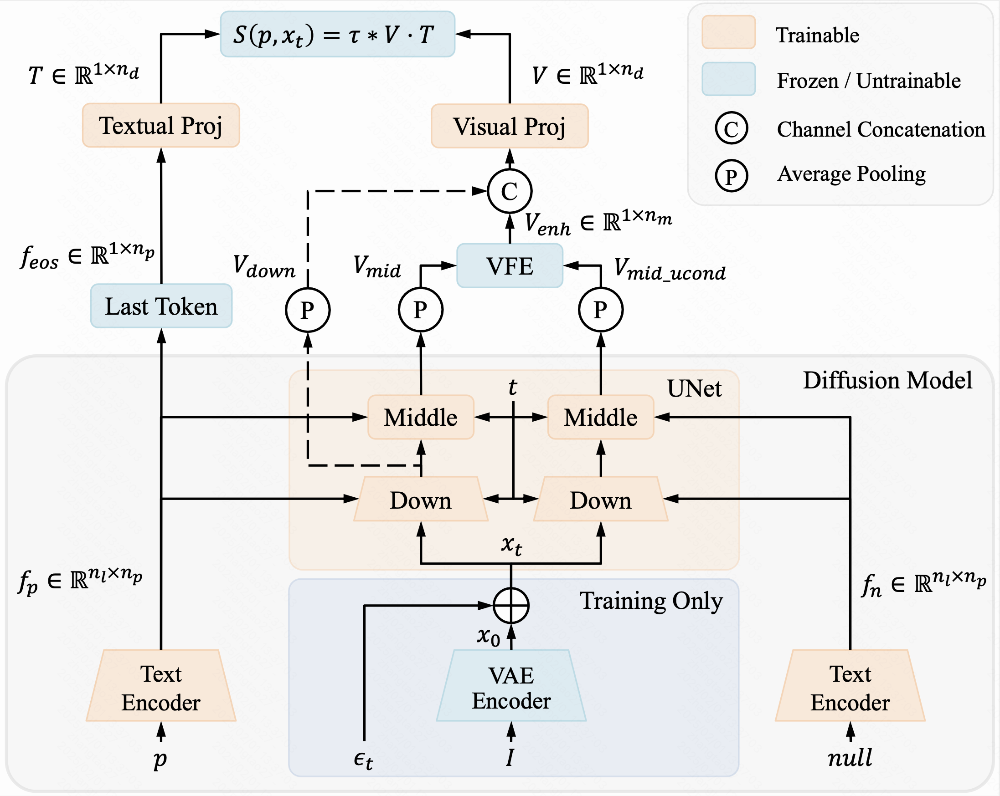
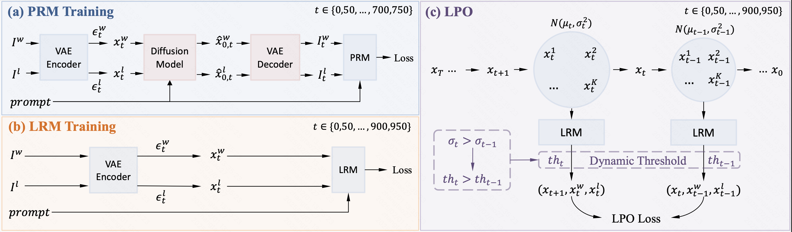
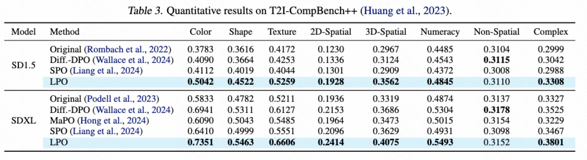
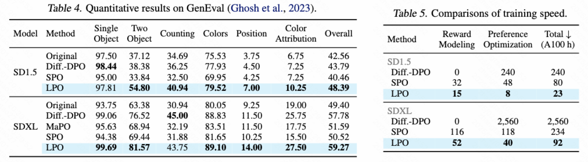

# LPO

This repository contains the official pytorch implementation of the paper “[Diffusion Model as a Noise-Aware Latent Reward Model for Step-Level Preference Optimization](https://arxiv.org/abs/2502.01051)” paper.

<p align="center">
  <a href='https://arxiv.org/abs/2502.01051'>
  </a> 
  <a href='https://huggingface.co/casiatao/LRM'>
  </a>
  <a href='https://huggingface.co/casiatao/LPO'>
  </a>
  <a href='https://visitor-badge.laobi.icu/badge?page_id=Kwai-Kolors.LPO'>
  </a> 
</p>

## 🎉 News
* 2025.03.20 🔥 The pre-trained models are released!
* 2025.03.20 🔥 The source code is publicly available!


## 📖 Introduction
<p align="center">

</p>

In this work, we analyze the challenges when pixel-level reward models are used in step-level preference optimization for diffusion models. Then we propose the Latent Reward Model (LRM) to utilize diffusion models for step-level reward modeling, based on the insights that diffusion models possess text-image alignment abilities and can perceive noisy latent images across different timesteps. We further introduce Latent Preference Optimization (LPO), a method that employs LRM for step-level preference optimization, operating entirely within the latent space.
<p align="center">

</p>

<p align="center">

</p>


Extensive experiments demonstrate that LPO significantly improves the image quality of various diffusion models and consistently outperforms existing DPO and SPO methods across the general, aesthetic, and alignment preferences. Moreover, LPO exhibits remarkable training efficiency, achieving a speedup of 10-28$\times$ over Diffusion-DPO and 2.5-3.5x over SPO.
<p align="center">

</p>

<p align="center">

</p>

<p align="center">

</p>


## 🛠️ Usage

### LRM Training

#### 1. Create conda environments and install packages

```bash
conda create -n lrm python=3.8
conda activate lrm
pip install torch==2.2.0 torchvision==0.17.0 torchaudio==2.2.0 --index-url https://download.pytorch.org/whl/cu118
cd ./lrm
pip install -r requirements.txt
cd ./lrm_15
pip install -e .
```

#### 2. Download
- Download the `pytorch_model.bin` from the `openai/clip-vit-large-patch14` [hugginface repository](https://huggingface.co/openai/clip-vit-large-patch14). Change the `clip_ckpt_path` in `lrm_15/trainer/conf/step_sd15.yaml` to its real storage path.
- Download the pre-computed score file from [Google Drive](https://drive.google.com/file/d/1baFGMntt6QxVqy8hzxQHfU9sCC-Eagq_/view?usp=drive_link), which contains multiple preference scores for images in Pick-a-Pic, and place it under the LRM folder.
#### 3. Training

- LRM-1.5

```bash
cd lrm_15
bash train_lrm_15.sh
```

- LRM-XL

```bash
cd lrm_xl
bash train_lrm_xl.sh
```


### LPO Training

#### 1. Create conda environments and install packages

```bash
conda create -n lpo python=3.9
conda activate lpo
pip install torch==2.2.0 torchvision==0.17.0 torchaudio==2.2.0 --index-url https://download.pytorch.org/whl/cu118
pip3 install -U xformers==0.0.24 --index-url https://download.pytorch.org/whl/cu118
cd ./lpo
pip install -r requirements.txt
```

#### 2. Download 
- Download the `pytorch_model.bin` from the `openai/clip-vit-large-patch14` [hugginface repository](https://huggingface.co/openai/clip-vit-large-patch14). Change the `clip_ckpt_path` in `lpo/lpo/preference_models/models/sd15_preference_model.py` to its real storage path. 
- Change the `ft_model_path` in the `lpo/configs` to real path of reward models. Our public reward models are available in [Hugging Face](https://huggingface.co/casiatao/LRM).
#### 3. Training

- Train SD1.5 using LRM-1.5

```bash
cd lpo
accelerate launch --config_file accelerate_cfg/1m4g_fp16.yaml train_scripts/train_lpo.py --config configs/lpo_sd-v1-5_5ep_cfg75_4k_beta500_multiscale_wocfg_thresh035-05-sigma.py
```

- Train SD2.1 using LRM-2.1

```bash
cd lpo
accelerate launch --config_file accelerate_cfg/1m4g_fp16.yaml train_scripts/train_lpo.py --config configs/lpo_sd-v2-1_5ep_cfg75_4k_beta500_multiscale_wocfg_thresh035-05-sigma.py
```

- Train SDXL using LRM-XL

```bash
cd lpo
accelerate launch --config_file accelerate_cfg/1m4g_fp16.yaml train_scripts/train_lpo_sdxl.py --config configs/lpo_sdxl_5ep_cfg75_8k_beta500_multiscale_wocfg_thresh45-6-sigma.py
```

### Pre-trained Models
- The pre-trained Latent Reward Models (LRM) are available in [Hugging Face](https://huggingface.co/casiatao/LRM).
- The optimized diffusion models by the Latent Preference Optimization (LPO) method are available in [Hugging Face](https://huggingface.co/casiatao/LPO).


## Citation
If you find this repository helpful, please consider giving it a star and citing:
```bibtex
@article{zhang2025diffusion,
  title={Diffusion Model as a Noise-Aware Latent Reward Model for Step-Level Preference Optimization},
  author={Zhang, Tao and Da, Cheng and Ding, Kun and Jin, Kun and Li, Yan and Gao, Tingting and Zhang, Di and Xiang, Shiming and Pan, Chunhong},
  journal={arXiv preprint arXiv:2502.01051},
  year={2025}
}
```


## Acknowledgments

This codebase is built upon the [PickScore](https://github.com/yuvalkirstain/PickScore) repository and the [SPO](https://github.com/RockeyCoss/SPO) repository. Thanks for their great work！
